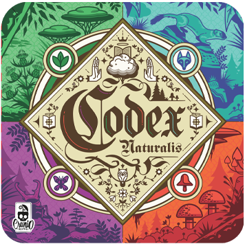

# Codex Naturalis


## Final Project for "Software Engineering" at PoliMi 23/24
[📖 Rules](Codex_Naturalis/deliverables/Rules/CODEX_Rulebook_EN.pdf)

[📝 License](Codex_Naturalis/LICENSE)

[📚 JavaDoc](Codex_Naturalis/deliverables/JavaDoc)

|  Feature  | Implemented  |
|-----|---|
| Complete rules | ✅ |
| Socket | ✅ |
| RMI | ✅ |
| TUI | ✅ |
| GUI | ⛔️ |
| Multiple Games  | ✅ |
| Resilience | ⛔️ |
| Server disconnections | ✅ |
| Chat | ✅ |

## How to Use
- In the [Deliverables](Codex_Naturalis/deliverables/JAR) folder there are two multi-platform JAR files: one for starting the Server and the other for starting the Client.
- The Server can be run with the following command, the RMI port is 50001, the socket port is 50000:
    ```shell
    > java -jar codex-naturalis-server.jar
    ```
  This command can be followed by this argument:
    - The desired IP address for the Server (useful when the are connection problems between Server and Client);

- The Client can be run with the following command:
    ```shell
    > java -jar codex-naturalis-client.jar
    ```
  This command can be followed by this argument:
  - **-graphics**: followed by 0 or 1 to show emojii in the CLI (default is set to 1, so emoji are displayed);
  - **-ip**: followed by the desired IP adress for the Client (useful when the are connection problems between Server and Client);

## Team (Group 31)

- [Aleksei Klak](https://github.com/aleksei-klak-polimi)
- [Matteo Orsenigo](https://github.com/teorse)
- [Michele Mafrici](https://github.com/Michele-Mafrici) 
